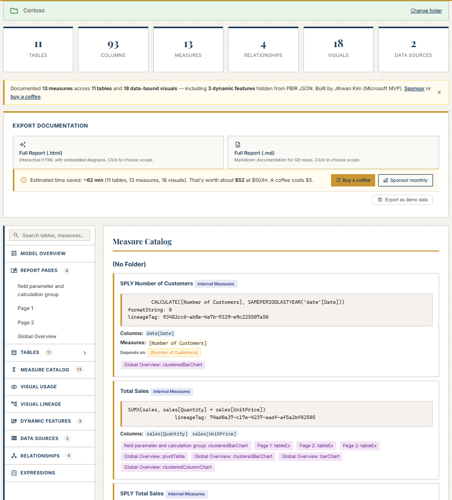
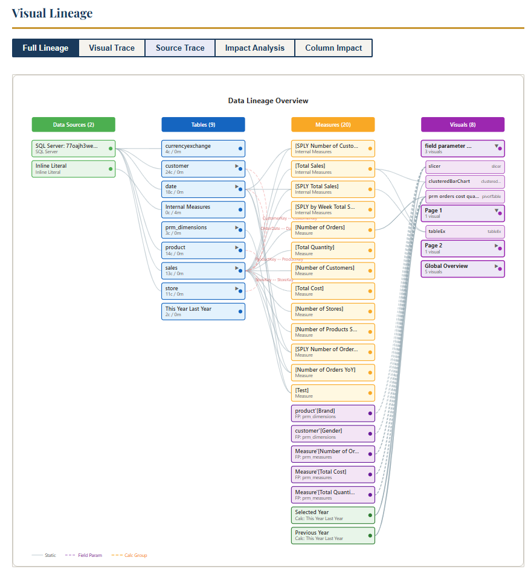

# PBIP Documenter

**Generate comprehensive, bidirectional documentation from Power BI PBIP/TMDL semantic models — instantly, in your browser.**

[](https://jonathanjihwankim.github.io/pbip-documenter/)
[](https://github.com/sponsors/JonathanJihwanKim)
[](https://buymeacoffee.com/jihwankim)
[](LICENSE)
[](https://github.com/JonathanJihwanKim/pbip-documenter/stargazers)
[](https://github.com/JonathanJihwanKim/pbip-documenter/commits/main)
[](https://mvp.microsoft.com/en-us/PublicProfile/5005229)

> **No PBIP file?** [Try the live demo with Contoso sample data](https://jonathanjihwankim.github.io/pbip-documenter/) — no setup required, runs entirely in your browser.

[](https://jonathanjihwankim.github.io/pbip-documenter/)

*Free forever — built nights and weekends, kept going by [sponsors ❤](#support-development).*

<details>
<summary>See the lineage engine →</summary>



</details>

> **✨ Updated 2026-04-20** — M-step parser (10 kinds), Value.NativeQuery SQL tracing, BigQuery 3-part source paths, field-parameter + calc-group badges in diagrams, broken-reference visualization, Physical-Source Index in Markdown exports. [Full changelog ↓](#whats-new-2026-04-20)

---

## What is PBIP / TMDL?

**PBIP** (Power BI Project) is a developer-friendly file format introduced in Power BI Desktop that stores your semantic model and reports as plain text files instead of a binary `.pbix`. It integrates with Git and CI/CD pipelines.

**TMDL** (Tabular Model Definition Language) is the text-based format within PBIP that describes every table, column, measure, relationship, and role in your semantic model — one `.tmdl` file per object, readable and diffable in any editor.

If you've enabled "Save as Power BI Project" in Power BI Desktop (Preview → Developer mode), your workspace folder already contains PBIP files ready for this tool.

---

## Who is this for?

### Power BI Developer
You write DAX measures and want to know:
- What tables and columns does each measure reference?
- Where (which pages, which visuals) is each measure displayed?
- Which measures depend on other measures?
- Are my field parameters and calculation groups visually distinct in the model diagram?
- Are any DAX references broken (renamed or deleted columns)?

**What you get:** Measure Catalog with full DAX + referenced columns/measures, "Used in Visuals" grouped by page, measure dependency chains, field parameter (purple) and calculation group (brown) header badges on diagrams, and red-dashed broken-reference indicators across all lineage views.

### Data Engineer
You own the source systems and want to know:
- Which physical tables (e.g. `dbo.FactSales`) were loaded into the model?
- Were columns renamed between source and model?
- Which DAX measures and report visuals ultimately consume each source table or column?
- What do the M queries actually do, step by step?
- Which physical columns does each model column map to — even without a rename?
- Does the model use `Value.NativeQuery` or Table.NestedJoin/Table.Combine?

**What you get:** Expanded Data Sources view showing physical→model table mapping, column renames, and a "Where Used" catalog per model column. Plus: a 10-kind M-step breakdown per table, `Value.NativeQuery` SQL preview with extracted table references, BigQuery `project.dataset.table` source paths, physical-column lineage nodes for every non-calc column, per-visual back-trace to physical `schema.table`, and a Physical-Source Index in Markdown exports.

### Product Owner / Manager
You need the big picture:
- How large is this model? How many measures, tables, visuals, data sources?
- What are the most-used measures and source tables?
- Are there any dynamic features (field parameters, calculation groups) that behave differently than PBIR JSON suggests?

**What you get:** Executive Summary at the top of every export with model stats, top measures by visual coverage, and top source tables by consumption.

*Saved you an afternoon? → [Sponsor monthly](https://github.com/sponsors/JonathanJihwanKim?o=readme-persona) or [buy a coffee](https://buymeacoffee.com/jihwankim?o=readme-persona).*

---

## Quick Start

1. Open the tool: **[jonathanjihwankim.github.io/pbip-documenter](https://jonathanjihwankim.github.io/pbip-documenter/)**
2. Select your persona (Power BI Developer / Data Engineer / Product Owner) — the app highlights the most relevant section after parsing
3. Click **Open Project Folder** and select your PBIP project folder
4. The tool auto-discovers `.SemanticModel` and `.Report` folders
5. Browse the parsed model in the sidebar — tables, measures, relationships, data sources, visuals, and more
6. Download documentation:
   - **Full Report (.html)** — self-contained with DAX highlighting, collapsible sections, column usage, data source drill-down
   - **Full Report (.md)** — clean Markdown with tables, ASCII layout grids, ideal for Git wikis
   - **JSON** — machine-readable with `whereUsed` blocks per column and `consumers` blocks per data source

### Manual documentation vs. PBIP Documenter

| | Manual | PBIP Documenter |
|---|---|---|
| 10 tables, 11 measures, 15 visuals | ~45 minutes | **< 10 seconds** |
| Source → model column lineage | Spreadsheet by hand | Auto-detected from M queries |
| Visual lineage tracing | Not feasible | Built-in |
| Relationship diagrams | Draw by hand | Auto-generated SVG |
| Keeps up with model changes | Start over | Re-run instantly |
| Privacy | Varies | 100% client-side |

---

## What You Get

Point the tool at your PBIP project folder and get professional, bidirectional documentation:

### For Power BI Developers (forward view)
- **Measure Catalog** — DAX expressions with syntax highlighting, display folders, format strings, referenced columns and measures, "Used in Visuals" by page
- **Table Inventory** — columns with data types, descriptions, sort-by, summarize-by, and hidden status
- **Relationships** — from/to columns, cardinality, cross-filter direction, active/inactive
- **Roles** — permission levels and RLS filter expressions per table
- **Diagram Legibility** — field parameters (purple) and calculation groups (brown) labeled distinctly; inactive relationships dashed; parallel edges between the same tables offset so they don't overlap; broken DAX references flagged with red dashed border and ⚠ icon in all lineage views

### For Data Engineers (reverse view)
- **Data Sources** — expanded view with physical table names (schema + table from Navigation steps), Power Query column renames, computed columns, and full consumer catalog (measures + visuals + pages). Text search + connector-type / Gateway / Parameterized chip filters. `Value.NativeQuery` shown with Native SQL badge + collapsible SQL preview.
- **M-Step Breakdown** — every `let…in` block decomposed into typed steps (Source / Navigation / Projection / Rename / Filter / Join / AddColumn / TypeChange / Expand / Custom) with refs, rendered as a numbered list with colored kind badges per table
- **Column Usage (Where Used)** — per table, every visible column shows which measures reference it and which visuals display it
- **Source Trace Lineage** — click a physical source table to open a forward lineage diagram: source → model table → measures → visuals
- **Physical-Column Lineage** — every non-calc model column has a first-class `physicalColumn` node; Column Impact shows the upstream physical source; BigQuery lineage captures the full `project.dataset.table` path

### For Product Owners (summary view)
- **Executive Summary** — model stats at a glance: tables, measures, relationships, pages, visuals, data sources, dynamic features, broken references
- **Top Measures** — ranked by number of visuals they appear in
- **Top Source Tables** — ranked by downstream visual coverage
- **Dynamic Features** — field parameters and calculation groups that PBIR JSON doesn't fully represent

### Interactive Diagrams
- **Relationship Diagram** — SVG with pan, zoom, and zoom-to-fit; star-schema layout. Field parameters shown with purple headers, calculation groups with brown headers, inactive relationships dashed, and parallel edges between the same table pair offset so they don't overlap
- **Visual Lineage** — full model, visual trace (including new "Physical Columns" column), measure impact, column impact (including upstream physical source), and source trace modes. Broken field references shown with red dashed border + ⚠ icon
- **Visual Usage Diagram** — field-to-visual mapping

### Export
- **HTML** — fully self-contained, embeds CSS + SVG, DAX syntax highlighting, collapsible sections, table of contents
- **Markdown** — clean document with fenced DAX blocks, ASCII page layout grids, structured tables, Physical-Source Index (`schema.table → model tables → consumer counts`), and per-visual back-trace (visual → fields → model tables → physical `schema.table` → renames → first M step)
- **JSON** — machine-readable with `whereUsed` and `consumers` blocks for downstream tooling

> Your files never leave your browser. All parsing happens client-side — nothing is uploaded anywhere.

---

## What's New (2026-04-20) {#whats-new-2026-04-20}

Four commits over two days closed 28 of 30 findings from a multi-perspective audit across enterprise BigQuery (61 tables), Contoso (10 tables), and demo datasets. Full findings: [docs/audit-2026-04-20.md](docs/audit-2026-04-20.md).

### For Power BI developers
- **ERD cardinality fixed** — draw.io and Mermaid exports previously defaulted every relationship to many-to-one. Now reads the correct `fromCardinality`/`toCardinality` from the TMDL parser.
- **FP + CG badges in overview diagram** — field parameter tables show a purple header, calculation group tables show brown. Before this, `prm_measures` and `This Year Last Year` looked identical to ordinary tables.
- **Enterprise layout rebuilt** — per-ring radius now sized to each ring's occupancy; 20 collision passes with 0.8 damping; parallel edges between the same table pair get a perpendicular offset so they no longer overlap. 61-table models no longer collapse into a blob.
- **Broken references visualized** — visual nodes with broken DAX/column references get a red dashed border + ⚠ icon across full lineage, visual trace, and impact diagrams.
- **Dataset-switch state reset** — `_resetState()` called at the top of `parseModel()` and `loadSampleData()`: clears diagram containers, lineage selects, stale warning banners, and the static M-parser cache. Switching between datasets no longer leaks stale state.

### For data engineers
- **M-step parser (10 kinds)** — every `let…in` block split into typed steps: Source / Navigation / Projection / Rename / Filter / Join / AddColumn / TypeChange / Expand / Custom. Rendered as a numbered list with colored kind badges in Table Detail.
- **Value.NativeQuery first-class** — native SQL detected, backing connector extracted, SQL parsed by a FROM/JOIN tokenizer that emits `sqlTableRefs` into the lineage graph. Rendered with a "Native SQL" badge + collapsible preview in the Data Sources view.
- **Table.NestedJoin / Table.Combine captured** — join metadata lifted into `result.joins[]` with step names and key columns, feeding the M-step graph.
- **BigQuery 3-part paths fixed** — chained `{[Name="project"]}[Data]{[Name="dataset"]}[Data]{[Name="table"]}[Data]` now walks all three levels. Previously only the last `Name=` value survived; enterprise BigQuery lineage now shows project + dataset + table.
- **Physical columns as first-class lineage nodes** — `physicalColumn` nodes previously only created on renames; now emitted for every passthrough non-calc column too, with `maps_to_physical_column` edges. Column Impact gained an upstream "Physical Source" column.
- **Calc-column + calc-table DAX wired** — calculated columns emit `references_column`/`references_measure` edges; calculated-table partitions emit `derived_from_table` edges. Previously produced zero lineage edges.
- **Per-visual back-trace in exports** — Markdown and HTML documents now walk visual → fields → model tables → physical `schema.table` → renames count → first M step (name + kind), replacing the old one-liner summary.
- **Physical-Source Index in Markdown** — new section: `schema.table → model tables → consumer counts` for each physical source.

---

## Browser Support

Requires the [File System Access API](https://developer.mozilla.org/en-US/docs/Web/API/File_System_Access_API):

| Browser | Support |
|---------|---------|
| Chrome 86+ | ✅ Supported |
| Edge 86+ | ✅ Supported |
| Opera 72+ | ✅ Supported |
| Firefox | ❌ Not supported |
| Safari | ❌ Not supported |

---

## PBIP Folder Structure

The tool expects a standard PBIP project layout:

<details>
<summary>Show folder structure</summary>

```
MyProject/
├── MyProject.SemanticModel/
│   └── definition/
│       ├── database.tmdl
│       ├── model.tmdl
│       ├── relationships.tmdl
│       ├── expressions.tmdl        (optional — shared M expressions / parameters)
│       ├── tables/
│       │   ├── Sales.tmdl
│       │   ├── Product.tmdl
│       │   └── ...
│       └── roles/                  (optional)
│           └── Reader.tmdl
└── MyProject.Report/               (optional — enables visual analysis)
    └── definition/
        └── pages/
            └── Page1/
                ├── page.json
                └── visuals/
                    └── visual1/
                        └── visual.json
```

</details>

---

## Also by Jihwan Kim

| Tool | Description |
|------|-------------|
| [PBIR Visual Manager](https://jonathanjihwankim.github.io/isHiddenInViewMode/) | Manage `isHiddenInViewMode` and visual properties in PBIR reports |
| [PBIP Impact Analyzer](https://jonathanjihwankim.github.io/pbip-impact-analyzer/) | Analyze what breaks when you change a measure, column, or table |
| **PBIP Documenter** | Generate bidirectional documentation from TMDL (you are here) |

---

## Support Development

PBIP Documenter is **free and open source**, built solo by [Jihwan Kim](https://github.com/JonathanJihwanKim) (Microsoft MVP) in evenings and weekends. Sponsorship is what lets me keep shipping — recent additions that landed directly from sponsor feedback: demo mode, Dynamic Features view, detailed ERD export, and lineage impact analysis.

### What your support enables

- Keeping the tool free, ad-free, and privacy-first (no data ever leaves your browser)
- Faster response on issues and feature requests
- Time for bigger roadmap items: printable detailed ERD, measure dependency diffing across model versions, more TMDL edge cases
- More open-source tooling in the `pbip-*` family for the Power BI / Fabric community

<a href="https://github.com/sponsors/JonathanJihwanKim?o=readme-support"></a> <a href="https://buymeacoffee.com/jihwankim?o=readme-support"></a>

### Sponsor Tiers

| Tier | Amount | What you get |
|------|--------|--------------|
| **Gold** | 50+ EUR/mo | Logo + link on README and app footer · Priority on feature requests |
| **Silver** | 10+ EUR/mo | Name + link on README · Shoutout in release notes · Priority on feature requests |
| **Bronze** | 7+ EUR/mo | Name + link in Hall of Sponsors · Early access to `pbip-*` betas |
| **Coffee** | One-time | Name listed in Hall of Sponsors · Warm fuzzy feeling |

### Hall of Sponsors 🙏

| Name | Tier |
|------|------|
| [Alessandro Tiberti Bertin](https://www.linkedin.com/in/aletb/) | Bronze |
| *Your name here* | [Become a sponsor →](https://github.com/sponsors/JonathanJihwanKim?o=readme-hall) |

---

## License

[MIT](LICENSE) — Jihwan Kim

**Built for:** Power BI · Microsoft Fabric · PBIP · PBIR · TMDL · Semantic Models · DAX · Data Governance · CI/CD · Developer Tools
